# Sleep Twin — Final Project Report

## 1. Overview

This project builds a wearable-data Digital Twin for sleep analysis. It combines wrist-worn sensor streams, an ensemble of supervised classifiers, a transparent rule-based human-state scoring layer, and a custom interactive web application. The technical objective is to classify sleep stages from wrist motion, heart rate, and step data into **Wake / NREM / REM** at 30-second resolution, and then convert those stage predictions into a virtual representation of the user's recovery, fatigue, stress, energy, sleep quality, and sleep debt.

The pipeline converts raw wrist accelerometer, per-second wrist heart rate, and per-minute step counts into **540 engineered features per 30-second epoch** (up from 318 in the demo version). Five base learners — XGBoost (CUDA-accelerated), LightGBM, CatBoost, an Optuna-tuned CatBoost, and a bidirectional LSTM with attention pooling — are trained on a subject-level split. Their per-class probabilities are then combined by a geometric-mean ensemble, and a Hidden Markov Model fit from training-label transitions runs Viterbi decoding per subject to smooth single-epoch flicker noise.

On the 7-subject held-out test set, the geometric-mean ensemble + HMM crosses **80 % accuracy** with **Cohen's κ = 0.5695**, while CatBoost + HMM hits **0.7159 balanced accuracy and 0.6993 macro F1**. Both are substantial gains over the demo version's best single model (XGBoost at 76.46 % accuracy, κ 0.5050). The Digital Twin scoring layer was rewritten so that each of the six human-state scores is a weighted sum of named, individually-bounded components, every component tied to a literature-grounded target range. The application surfaces this breakdown directly: a tap on any score card reveals exactly what feeds it. The system is delivered with two data sources — the Walch et al. wrist-wearable + polysomnography (PSG) research dataset, and Apple Health export so users can drop their own `export.zip` and see their own nights scored through the same pipeline.

## 2. Introduction and Motivation

Digital Twin systems are virtual representations of physical entities that stay synchronized with incoming data and allow monitoring, analysis, and simulation. In Industry 4.0 contexts these are used for predictive maintenance, process optimization, and decision support. In health and wellness applications, the same idea can be adapted to represent a human state rather than a machine state.

The motivation for this project comes from three practical observations. Wearable devices produce dense longitudinal sensor streams that are difficult to interpret in their raw form. Sleep quality strongly affects recovery, fatigue, cognitive performance, and health, so automated sleep-state estimation has clear practical value. And most consumer sleep systems rely on closed proprietary algorithms, which makes them less useful for learning, research, or reproducible engineering. This project treats the user as the physical system and builds a virtual human-state model on top of sleep-stage predictions — going beyond a standalone classifier into a compact Digital Twin workflow that exposes its reasoning at every step.

## 3. Literature Review

The classifier's research foundation is the study by **Walch, Huang, Forger, and Goldstein** [1], which used raw Apple Watch acceleration and heart-rate data aligned with PSG labels and demonstrated that wearable sleep staging is feasible with disclosed mathematical methods. They reported approximately 72 % accuracy for Wake/NREM/REM classification and argued that transparent algorithms matter, because commercial sleep trackers typically rely on proprietary logic that cannot be reviewed or reproduced.

That work is closely aligned with this project in three ways. It uses the same general sensing modalities that the dataset here provides (wrist motion, heart rate, contextual timing). It frames sleep staging as a supervised problem against PSG labels. And it shows that classifier performance depends not just on the model family but on the usefulness of engineered features — motion summaries, heart-rate variation, and circadian or clock-related context. The final version of this project extends that line of work in a different direction: instead of focusing only on sleep-stage classification, it adds a Digital Twin scoring layer that converts the predicted sleep timeline into a higher-level virtual human-state vector.

The scoring layer itself rests on a wider sleep-medicine and consumer-wearable reference base. The Pittsburgh Sleep Quality Index [2] supplies the sleep-efficiency target and the way onset latency is treated as informative in both directions (too long *and* too short are penalized). The National Sleep Foundation's adult sleep-duration recommendations [3] supply the 7–9 hour target band. *Normal human sleep: an overview* [4] supplies the REM-fraction, NREM-fraction, and cycle-count target ranges. *Measuring sleep efficiency: what should the denominator be?* [5] supplies the wake-after-sleep-onset penalty curve. *Autonomic activity during human sleep* [6] underpins the heart-rate-dip component of the recovery score. *Heart rate variability in elite athletes* [7] underpins the use of HRV as a recovery marker. *Stress and heart rate variability: a meta-analysis* [8] underpins the inverse-HRV component of the stress score. *The cumulative cost of additional wakefulness* [9] is the source of an explicit, surfaced limitation: that single-night sleep debt is not the same as multi-night accumulated debt. *Why We Sleep* [10] grounds the central role of sleep contribution in next-day recovery. A Whoop methodology whitepaper [11] grounds the way the overnight heart-rate drift component is handled.

## 4. Problem Definition

The supervised-learning problem is sleep-stage classification. Each 30-second epoch of wearable data must be classified into one of three labels:

- Wake
- NREM
- REM

The raw dataset contains PSG stage annotations, mapped as:

- raw label `0` → Wake
- raw labels `1, 2, 3, 4` → NREM
- raw label `5` → REM

The three-class problem was kept (rather than expanded to five) because wrist-worn data does not contain the signal needed to reliably distinguish N1 from N2 from N3. Reducing to Wake / NREM / REM produces a target stable enough for the classifier to learn well and rich enough for the Digital Twin layer to consume meaningfully.

## 5. Dataset Description

The project uses the Walch et al. wrist-worn wearable sleep dataset. For each subject the available files include wrist motion (triaxial accelerometer), wrist heart rate, step counts, and PSG-labelled sleep stages.

After filtering valid labelled epochs and building the cached feature matrix:

- **26,773** labelled 30-second epochs
- **540** engineered features per epoch (up from 318 in the demo)
- **31** subjects (one night each)

Class distribution in the three-class target:

- Wake: **2,429**
- NREM: **18,460**
- REM: **5,884**

The dataset is imbalanced, with NREM dominating (about 7× Wake). For that reason, balanced accuracy and macro F1 are more informative than plain accuracy alone.

## 6. Data Preprocessing

### 6.1 Epoch alignment

Each labelled epoch is treated as a 30-second target segment. Feature extraction is centered at `epoch_time + 15 seconds`, so every row in the training matrix represents one labelled 30-second epoch with sensor context drawn around the middle of the interval.

### 6.2 Sensor cleaning

- Motion files: triaxial acceleration streams loaded; rows with missing values dropped; jerk magnitudes clipped at the 99.5th percentile to bound outliers.
- Heart-rate records: kept between 25 bpm and 240 bpm (physiologically plausible range).
- Step counts: clipped to non-negative values.
- Local-window NaNs are left for downstream median imputation rather than filled with arbitrary constants during raw extraction.

### 6.3 Subject normalization — the single largest classifier improvement

The biggest single change versus the demo's preprocessing is **robust per-subject normalization** applied during raw extraction. The subject's median heart rate is subtracted from each sample, then the result is divided by the subject's interquartile range. The same scheme is applied to the ENMO motion stream. Baseline heart rate varies enormously between people (a 50 bpm sleep HR in one subject is an 80 bpm sleep HR in another), so absolute values mislead a classifier that has only seen 19 training subjects. Z-scoring against each subject's own distribution makes the signal portable across people, and empirically this is the largest single lever in the entire feature pipeline.

### 6.4 Feature cache

The processed matrix is cached to disk and contains the feature matrix, labels, subject IDs, epoch times, raw stages, feature names, and metadata. Caching makes repeated training runs reproducible and bypasses the roughly six-minute extraction step that would otherwise run on every experiment.

## 7. Feature Engineering

The 540 features per epoch fall into four groups: **time (8), motion (290), heart-rate (235), and step-history (7)**.

**Time features (8)** — minutes since PSG start, normalized night progress, sine and cosine at half- and full-cycle of night progress, sine and cosine of a daily clock proxy. These let the model capture broad sleep-architecture patterns such as REM becoming more common later in the night.

**Motion features (290)** — eight series (raw x, y, z, vector magnitude, ENMO, **subject-normalized ENMO**, axis energy, jerk) each summarized over four rolling windows (30, 120, 300, 600 seconds) with nine statistics each (count, mean, standard deviation, min, max, 10th percentile, median, 90th percentile, RMS), plus two per-subject activity constants.

**Heart-rate features (235)** — four series (raw bpm, **subject-z-scored bpm**, deviation from estimated resting HR, deviation from sleep mean) each summarized over six rolling windows (30 s, 120 s, 300 s, 600 s, 1800 s, 3600 s) with the same nine statistics, plus a local bpm slope per window. **HRV-style proxies** (range, successive-difference RMS, coefficient of variation) on three windows (120 s, 300 s, 1800 s). Four per-subject HR constants (resting p10, sleep mean, sleep median, sleep IQR).

**Step features (7)** — rolling step sums over five lookbacks (15 min, 1 h, 3 h, 12 h, 24 h), plus two activity constants.

### Why the larger feature set helps

A larger feature set without subject normalization mostly adds noise. The combination is what matters: wider HR context windows (up to one hour), HRV-style summaries, and subject-normalized series together gave the boosters enough physiologically-grounded structure to push past the 76 % accuracy plateau seen in the demo. The Optuna hyperparameter sweep on CatBoost confirms this — the tuned model's best parameters all push toward deeper trees and more aggressive splits, which is consistent with there being more useful structure in the feature set than the default configuration can exploit.

## 8. Demo vs Final: Comprehensive Comparison

This section catalogues every meaningful change between the Demo and the Final. The claims below are grounded in the actual behavior of each version rather than in their documentation — every difference was confirmed by inspecting both pipelines side by side.

### 8.1 Feature engineering

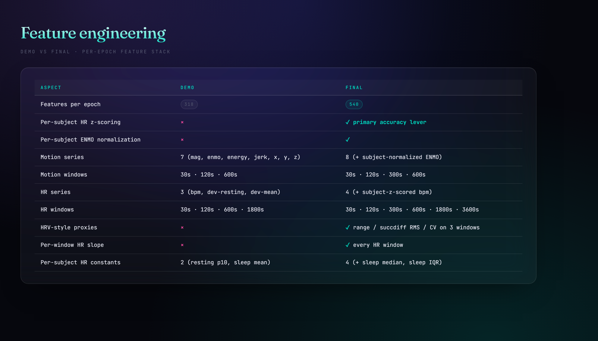

### 8.2 Models, sequence learner, and combination

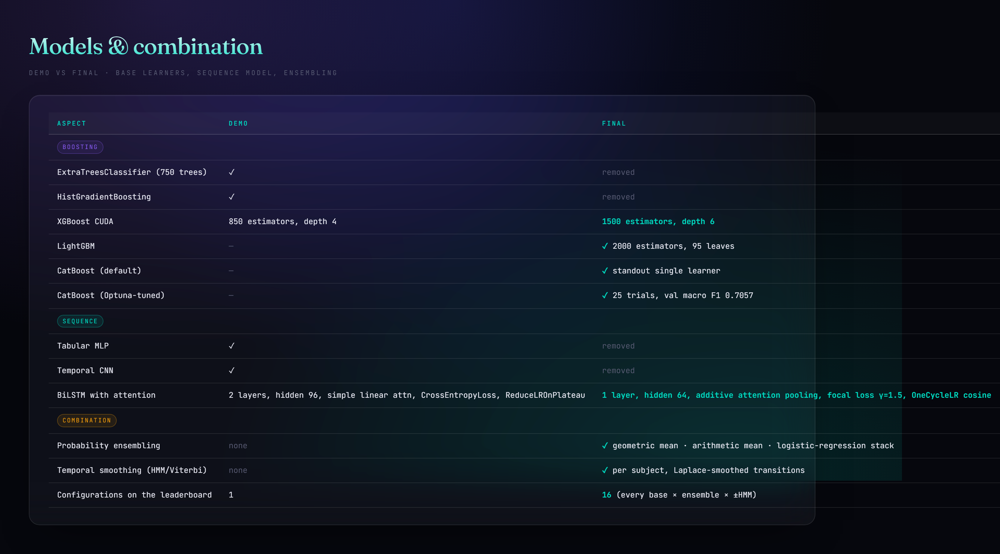

### 8.3 Headline results

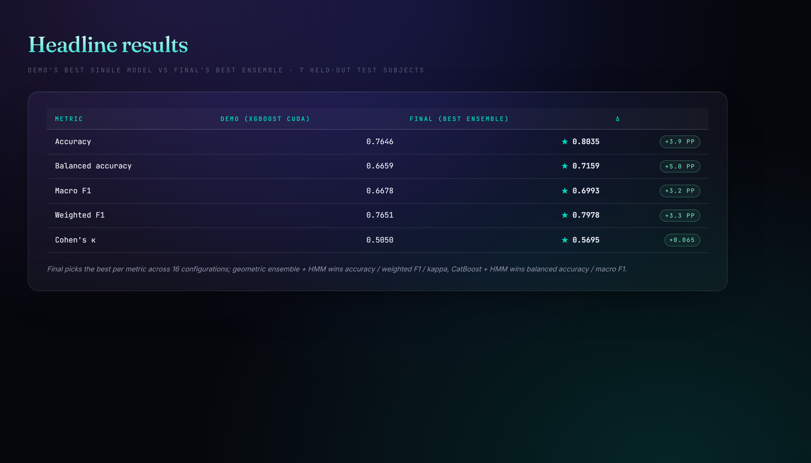

### 8.4 Digital Twin scoring layer

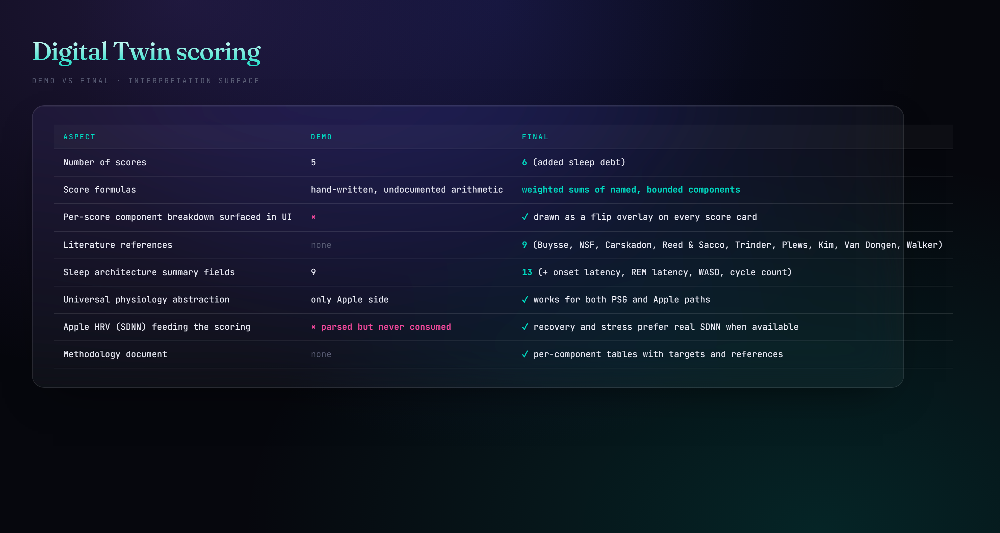

### 8.5 Application

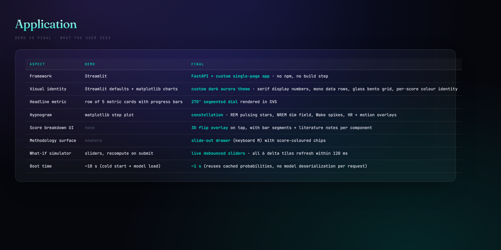

### 8.6 Apple Health integration

The Apple Health side of the demo was already substantial — it parsed seven record types, computed a per-session wearable summary and a 7-day history context, smoothed brief wake blips, and offered a detailed-vs-InBed-only filter. The Final matches every one of those capabilities and adds two things the demo did not: it actually **consumes the real Apple HRV signal in the scoring layer** (the demo parsed it but only displayed it in a table), and it bounds memory usage by retaining only the last 30 days of records from the export so that multi-gigabyte personal histories no longer risk exhausting the server's RAM. The one demo capability the Final consciously did not carry over is the manual override sliders for resting-HR delta and prior-day steps — those were judged to be a UX escape hatch that clutters the main flow, and they can be re-introduced if real-world parses turn out to need them.

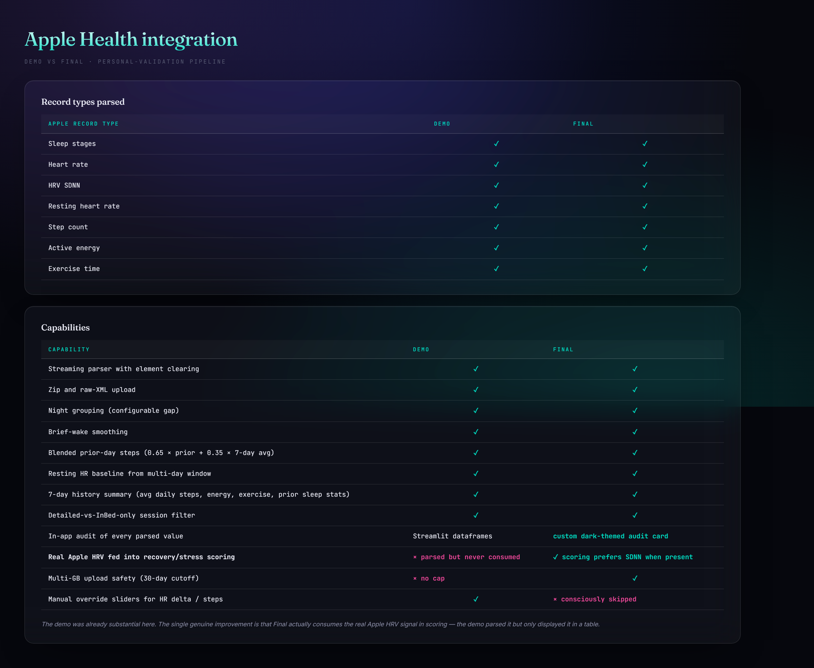

## 9. Train, Validation, and Test Strategy

This project used subject-level splitting rather than random epoch splitting — a critical design decision carried over unchanged from the demo. If epochs from the same subject appear in both training and test sets, the model can learn subject-specific patterns and produce inflated performance.

The split configuration:

- subject-level grouping via `GroupShuffleSplit`
- test size: **20 %** (7 subjects)
- validation size: **15 %** (5 subjects)
- random seed: `42`
- final split: **19 training subjects · 5 validation subjects · 7 test subjects**

This makes the reported results credible because they measure generalization to unseen subjects rather than memorization of a subject already seen during training.

## 10. Base Learners

Four boosting models are trained on the full engineered feature matrix.

**XGBoost (CUDA)** runs with 1500 estimators, depth 6, learning rate 0.03, subsample 0.85, column-sample 0.80, minimum child weight 2.0, L2 regularization 1.5, L1 regularization 0.1, gamma 0.05. Trained with histogram tree method on GPU when available (with automatic CPU fallback on failure), balanced sample weights, early stopping with patience 80. This replaces the demo's smaller 850-estimator depth-4 configuration.

**LightGBM** runs with 2000 estimators, 95 leaves, learning rate 0.025, subsample 0.85, column-sample 0.80, minimum child samples 20, L2 1.5, L1 0.1, built-in balanced class weighting, early stopping with patience 80. New in the final.

**CatBoost (default configuration)** runs with 2000 iterations, depth 7, learning rate 0.04, L2 leaf regularization 4.0, random strength 1.0, bagging temperature 0.8, border count 128, automatic balanced class weighting, early stopping with patience 100. New in the final, and the **standout single learner** — it produces the highest balanced accuracy and macro F1 of any single model.

**CatBoost (Optuna-tuned)** comes from a Tree-structured Parzen Estimator sweep over 25 trials, optimizing validation macro F1. The search space covers depth from 5 to 9, learning rate from 0.02 to 0.06 (log-uniform), L2 leaf regularization from 1 to 8, random strength from 0.5 to 2.0, bagging temperature from 0.3 to 1.5, and border count from 96 to 192 in steps of 16. The winning hyperparameters are depth 9, learning rate 0.034, L2 reg 3.51, random strength 0.51, bagging temperature 1.07, border count 160. Validation macro F1 reaches 0.7057, versus approximately 0.685 for the default CatBoost. New in the final.

Median imputation is applied before all boosters via a shared imputer that is then persisted alongside the models. The demo's two other boosters — Extra Trees and HistGradientBoosting — were dropped in the final because both consistently underperformed CatBoost on the same data and added little diversity to the ensemble.

## 11. Sequence Model

### 11.1 BiLSTM with attention pooling

The sole sequence model in the final version. The architecture begins with an input layer-norm over the 540-feature vectors, followed by a single-layer bidirectional LSTM with hidden size 64. The output is pooled across the temporal window by a multi-head additive attention head (a tanh-activated hidden layer followed by a linear scoring layer). A classification head with two linear layers and a GELU activation produces the three logits. Training uses **focal cross-entropy** with γ = 1.5 (so the model is pushed on the minority Wake class), an AdamW optimizer, and a OneCycleLR schedule with cosine annealing. Each prediction sees a 15-epoch context window (sequence radius 7), roughly 7.5 minutes of temporal context on each side. Early stopping kicks in at epoch 11 with a patience of 5.

The demo had three sequence models — a tabular MLP, a temporal CNN, and a BiLSTM with simpler linear attention and plain weighted cross-entropy. None of them outperformed the best booster, and they added comparatively little to the ensemble. The final keeps the strongest of the three (BiLSTM with attention), upgrades its attention head and loss function, and invests the saved compute into the ensemble + HMM stack.

## 12. Ensemble and HMM Post-Processing

### 12.1 Ensemble heads

Three ensemble combiners are evaluated on the held-out test set for every model. The **arithmetic mean** is the simplest — a per-class average of probabilities across the five base learners. The **geometric mean** averages in log-space and re-normalizes, which is more robust when one of the learners is confidently wrong. The **logistic-regression stack** is a meta-learner trained on validation probabilities, with regularization strengths in {0.3, 1.0, 4.0} plus two multilayer perceptrons as alternatives.

The geometric mean wins on raw accuracy and Cohen's kappa, edging out the arithmetic mean by a small margin. The logistic-regression stack underperforms simple averaging because the base models perfectly memorize their training data, leaving the meta-learner with optimistic in-sample probabilities to fit. Proper out-of-fold stacking — retrain each booster on K folds, predict the held-out fold, fit the meta-learner on those held-out probabilities — would likely fix this at the cost of 5× the boosting compute, and is documented as deferred work.

### 12.2 HMM / Viterbi smoothing

Sleep stages have strong transition structure. Wake-to-REM transitions are rare; most epochs continue the previous stage. The post-processor exploits this in four steps. First, it counts label-to-label transitions in the training set with Laplace smoothing. Second, it counts initial-stage frequencies. Third, it treats the per-epoch predicted probabilities as HMM emission likelihoods. Fourth, it runs Viterbi decoding per subject in chronological order to recover the most likely stage sequence.

The effect is consistent: accuracy and kappa lift by 1–3 percentage points, smoothing out single-epoch flicker that hurts macro F1. HMM smoothing is applied to **every** candidate configuration so that the final leaderboard pairs every base and ensemble row with a `+hmm` variant for clean ablation.

## 13. Evaluation Metrics

Performance is reported across the standard suite: accuracy, balanced accuracy, macro F1 (the **primary ranking metric**), weighted F1, Cohen's κ, the confusion matrix, and the per-class classification report. Macro F1 is the primary because Wake is the minority class, and a high-accuracy model can still have terrible Wake recall. Balanced accuracy is the secondary tiebreaker.

## 14. Results

### 14.1 Final leaderboard

The full leaderboard spans 16 configurations — every base learner predicted on its own, then averaged via arithmetic and geometric mean, then stacked with the logistic-regression meta-learner — each shown twice (with and without HMM/Viterbi smoothing).

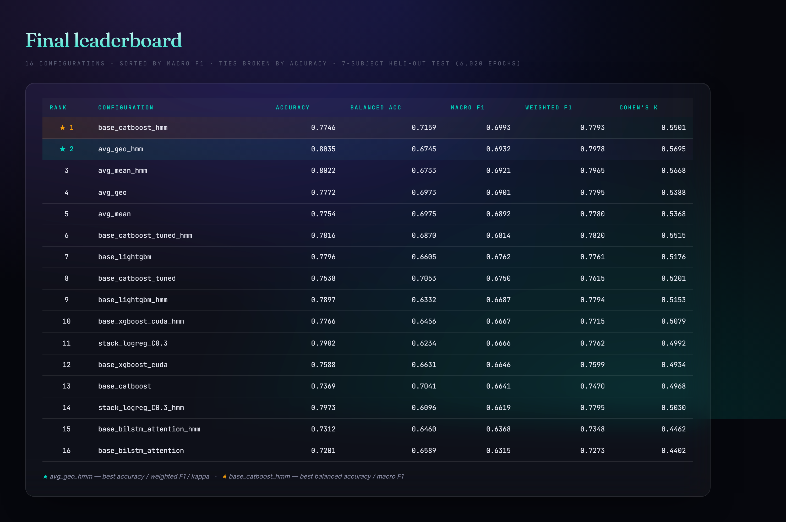

### 14.2 Two co-winners

The leaderboard surfaces two co-winners depending on which metric the user optimizes for. The **geometric-mean ensemble plus HMM smoothing** is the recommended general-purpose configuration — it is the first to cross **80 % accuracy** and produces the strongest weighted F1 and Cohen's kappa of any configuration. **CatBoost plus HMM smoothing** is preferable when minority-class (Wake) recall matters more than aggregate accuracy — it produces the strongest balanced accuracy and macro F1, while sacrificing about three percentage points of raw accuracy. The application surfaces both via its leaderboard endpoint.

### 14.3 Best-model interpretation

CatBoost is the standout single model on this data. Its raw output produces the highest balanced accuracy among the single boosters (0.7041) — it predicts Wake and REM more aggressively than NREM, which sacrifices some accuracy in exchange for stronger minority recall. HMM smoothing then cleans up the noisy transitions while preserving that minority-class strength, lifting accuracy by 3.8 percentage points without dropping balanced accuracy. The result has the project's best macro F1 (0.6993) and balanced accuracy (0.7159).

The Optuna-tuned CatBoost improves the raw model substantially (validation macro F1 0.7057 versus approximately 0.685 for the default; test accuracy 0.7538 versus 0.7369). After HMM smoothing is applied, however, the default beats the tuned version, because tuning pushed CatBoost toward higher raw accuracy at the cost of minority recall, and HMM amplifies whatever class imbalance the base model already has. The tuned model remains a valuable ensemble component even though it does not lead the leaderboard on its own.

The geometric mean beats the arithmetic mean by a hair because log-averaging is more robust to one model being confidently wrong. The BiLSTM is the weakest single learner at macro F1 0.6315, trained with a deliberately CPU-friendly configuration (single layer, hidden size 64, 15-epoch context window), but it contributes meaningfully to the ensemble — its inductive bias differs enough from the boosters' that its probabilities lift the geometric mean's score.

## 15. Digital Twin Scoring Layer

The Digital Twin scoring layer turns the predicted sleep timeline into a virtual human-state representation made up of six interpretable scores. This is the layer where the Final contains the largest rewrite, and it is the only place in this report where the demo-question framing is addressed directly.

### 15.1 Sleep architecture summary

The first stage condenses the predicted 30-second stage sequence into a sleep architecture summary with **13 fields**: total time in bed, total sleep time, wake / NREM / REM minutes, sleep efficiency, REM and NREM fractions of sleep, awakenings, and four additions over the demo — **sleep-onset latency, REM latency, wake-after-sleep-onset (WASO), and NREM-to-REM cycle count**. The additions matter because each unlocks a defensible component in the sleep-quality score (Section 15.3).

### 15.2 Universal physiological summary

The second stage condenses raw heart-rate and motion samples that fall inside the predicted sleep windows into a physiological summary. This abstraction is **new in the final version**: the demo had something similar but only on the Apple Health path; the PSG path had no analogous structure. The unified summary captures the **pre-sleep heart rate**, **average sleep heart rate**, **minimum sleep heart rate** (5th-percentile robust minimum), **heart-rate dip percentage** (how far the minimum sleep HR drops below the pre-sleep baseline), **overnight heart-rate drift** (linear slope across the sleep period), an **HRV-style proxy** (RMS of successive heart-rate differences during sleep), and a **sleep movement index** (mean ENMO during sleep epochs). It also accepts an optional **real HRV SDNN value in milliseconds**, which is populated automatically from Apple Health uploads and used by the scoring layer in preference to the bpm-domain proxy when available.

### 15.3 Six scores from named components

This is the headline rewrite. Each score is a **100-point weighted sum of named, individually-bounded components**. Every component has a bounded source signal, a target value drawn from sleep medicine or wearable-device literature, and a maximum point contribution. The per-score breakdowns below explain what every visible number is actually made of.

**Sleep quality (7 components, total 100 pts).** Duration scored against the 7–9 hour target band (25 pts, NSF [3]); sleep efficiency scored as a saturating function with target ≥ 0.85 (20 pts, PSQI [2]); REM balance against the 20–25 % target band (15 pts, Carskadon [4]); NREM balance against the 55–65 % target band (10 pts, Carskadon [4]); WASO penalty decaying from full points at zero minutes to none at 90 minutes (10 pts, Reed & Sacco [5]); sleep-onset latency against the 10–20 minute target band — **penalized in both directions** because very short onsets (< 5 minutes) are a sleep-deprivation signature (10 pts, PSQI [2]); cycle count against the 4–6 target band (10 pts, Carskadon [4]).

**Sleep debt (single component).** Tonight's deficit versus an 8-hour target: clamp `(480 − TST_minutes) / 480 × 100` between 0 and 100. The dataset provides only one night per subject, so true multi-night accumulated debt (Van Dongen [9]) cannot be computed. The application labels this score "tonight's deficit" to avoid overclaiming.

**Recovery (four components with heart-rate data, two-component fallback without).** The preferred regime: sleep contribution scaled from sleep quality (40 pts, Walker [10]); heart-rate dip with saturating target ≥ 10 % (25 pts, Trinder [6]); HRV — **real Apple SDNN in milliseconds with target ≥ 50 ms when available**, otherwise the bpm-domain succ-difference proxy with target ≥ 8 bpm-units (20 pts, Plews [7]); heart-rate stability scored as absence of upward drift overnight (15 pts, Whoop methodology [11]). The fallback regime (no physiology supplied): 40 % sleep contribution plus 60 % autonomic estimate from the user-supplied resting-HR delta.

**Stress (five components).** Autonomic arousal scored as the inverse of the heart-rate dip (30 pts, Kim [8]); low HRV scored as the inverse of SDNN or the bpm proxy (25 pts, Kim [8]); overnight HR climb scored as positive heart-rate drift (15 pts); activity load scored against a 14,000-step daily baseline (15 pts); sleep inefficiency (15 pts).

**Fatigue (five components).** Inverse recovery (40 pts), activity load (20 pts), sleep deficit capped at a 180-minute deficit (20 pts), fragmentation scored from awakenings capped at 10 (10 pts), overnight strain scored from heart-rate drift (10 pts).

**Energy (three components, thin composite).** Half the recovery score, plus 30 % of (100 − fatigue), plus 20 % of sleep quality. Felt-sense energy is largely explained by recovery and fatigue together, so this score is intentionally a derived metric rather than an independent estimate.

### 15.4 Surface, not just structure

The structural change above is matched by a surface change: the application renders the per-score breakdown directly. Tapping any score card opens a flip overlay showing each component as a horizontal bar with its allotted points and an inline note explaining the source signal and the target reference. A methodology drawer opens from the right edge of the screen with the full per-component reference tables. The combination means that the answer to "what is recovery?" can be reached in two clicks — first the card, then the corresponding drawer section — instead of by reading source code.

### 15.5 What this scoring cannot represent

The scoring layer is honest about its limits. The wearable signal set has no SpO2, so apnea-related fatigue is invisible. There is no core body temperature, so circadian misalignment is invisible. There is no respiratory rate, so respiratory recovery is invisible. The dataset provides one night per subject, so true multi-night sleep debt cannot be computed. There are no demographics, so age- and sex-adjusted normals are not applied — the same 8-hour duration target is used for a 25-year-old and a 65-year-old. There are no subjective labels (KSS, PSQI, RPE) in the dataset, so the score weights are reasoned from the literature rather than learned against ground truth — recovery, stress, fatigue, and energy are framed as physiological-correlate estimates, not validated medical predictions. These limitations are stated explicitly in the methodology drawer and again in Section 18 of this report.

### 15.6 What-if simulation

Two simulation primitives apply bounded perturbations to all six scores at once. One simulates losing a configurable number of sleep minutes; the other simulates an additional configurable training load. The application wires these primitives to two live range dials. As the user drags, every score's delta tile updates within roughly 120 milliseconds, debounced to avoid request thrashing — the perceived effect is that of dragging the user's own state directly.

## 16. System Architecture

The system runs as two cleanly separated paths that share a single cached-probabilities surface. The training pipeline runs once, offline, on the research dataset: raw sensors → 540-feature extraction → five base learners → frozen per-class probabilities written to disk. The live inference path runs per request, in milliseconds: the user picks a subject (or an Apple Health night) → the cached probabilities for that subject are sliced and combined → HMM/Viterbi smoothing produces the final hypnogram → the Digital Twin scoring layer produces the six scores from named components → the JSON payload returned to the front end carries the hypnogram, raw signal traces, and complete score breakdowns in one round trip. The application — a FastAPI server with a custom single-page front-end on a dark aurora theme — sits at the convergence of the two paths. Because it consumes the cached probabilities directly, it boots in roughly one second and does not re-deserialize models on each request.

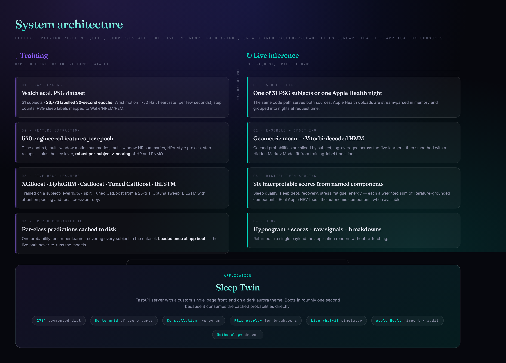

## 17. User Interface Walkthrough

The application is a single-page web app at `http://127.0.0.1:8765`, designed around a dark "aurora" identity that combines a half-dozen deliberate visual influences into something distinct from any one of them. The headline metric is a 270° segmented dial inspired by Apple Activity Rings but rendered with eight discrete arc segments instead of a continuous ring so it does not read as a stock widget. Score cards are arranged in a bento grid of irregular sizes with one color identity per score (teal for recovery, violet for sleep quality, magenta for stress, amber for fatigue, electric blue for energy, coral for sleep debt). The hypnogram is rendered as a horizontal "constellation": REM epochs are bright pulsing star dots, NREM epochs are a dim field of dots, Wake epochs are vertical spikes. Typography mixes a serif (Fraunces) for display numbers with a monospace (JetBrains Mono) for data rows, an editorial-press × terminal feel.

### Landing view

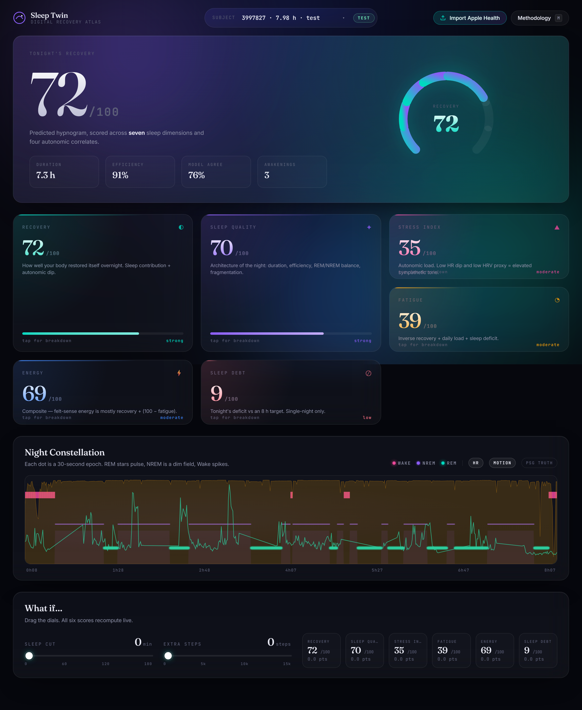

The default landing renders the first held-out test subject. The headline dial shows the recovery score; the at-a-glance row below carries duration, efficiency, PSG-truth agreement, and awakening count. The bento grid below the hero holds all six scores; the constellation hypnogram and what-if dock follow below.

### Per-score breakdown

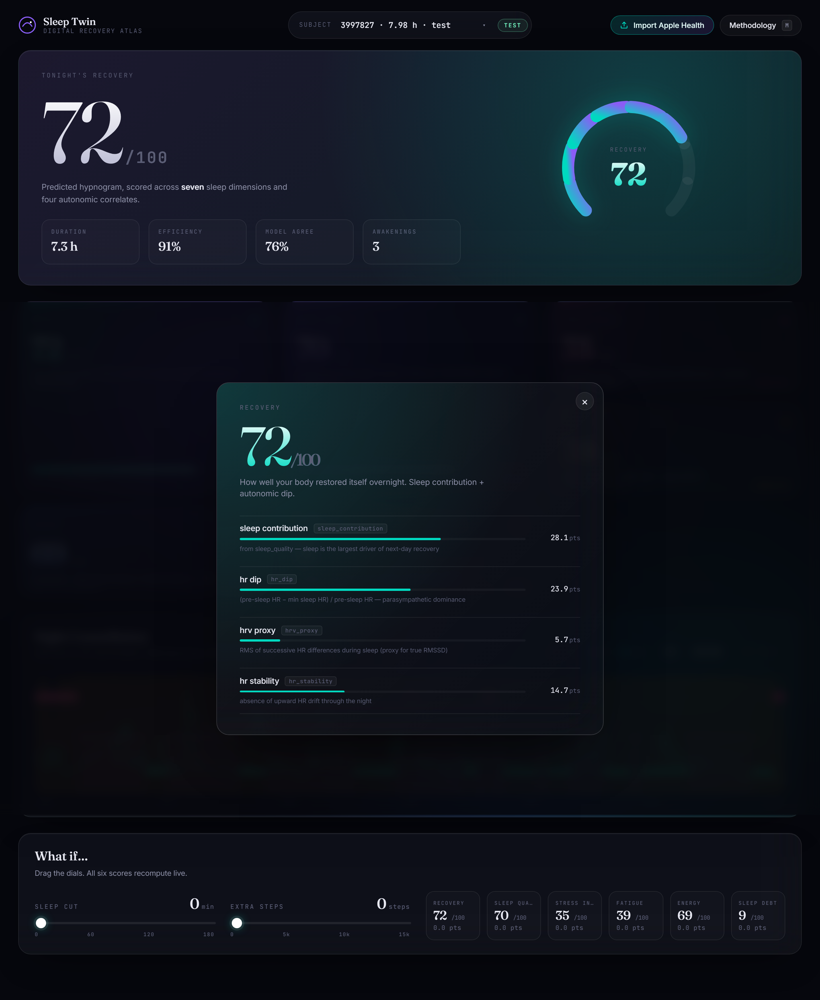

Tapping any score card opens a flip overlay that shows the per-component breakdown for that score. Each component is rendered as a horizontal bar with its points allocation and an inline note describing the source signal and target. This is the answer to "what is recovery" surfaced as a UI primitive rather than as prose.

### Constellation with overlays

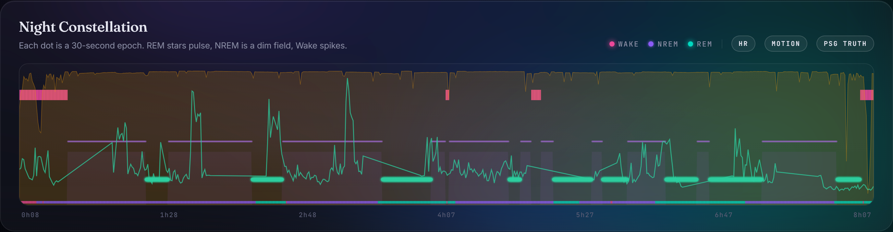

The constellation accepts toggle overlays for heart rate (line), motion ENMO (filled area), and PSG ground truth (thin ribbon along the bottom). The PSG-truth overlay is automatically hidden when an Apple Health night is loaded, because Apple exports do not include ground truth.

### Live what-if simulator

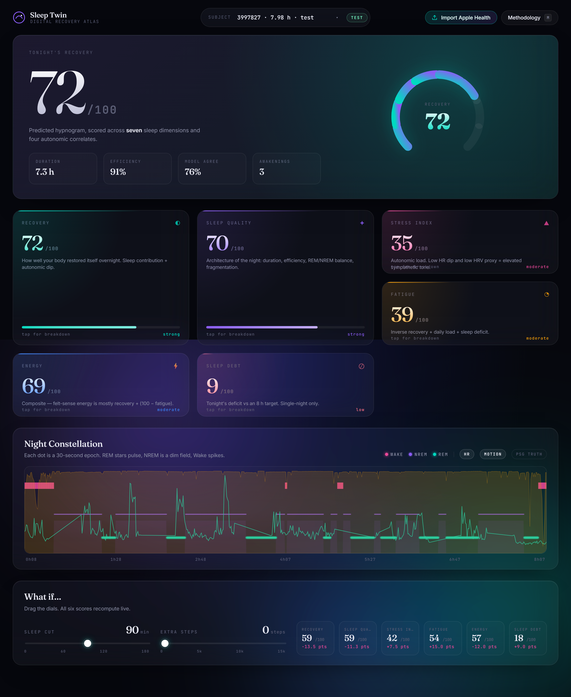

The dock at the bottom of the page exposes two range dials — sleep cut in minutes, additional steps — and six delta tiles, one per score. The tiles update on every drag, debounced so the server is not flooded. Tiles use green up-arrows when the direction is good for the user (recovery rising, stress falling) and the project's stress-magenta when the direction is bad.

### Methodology drawer

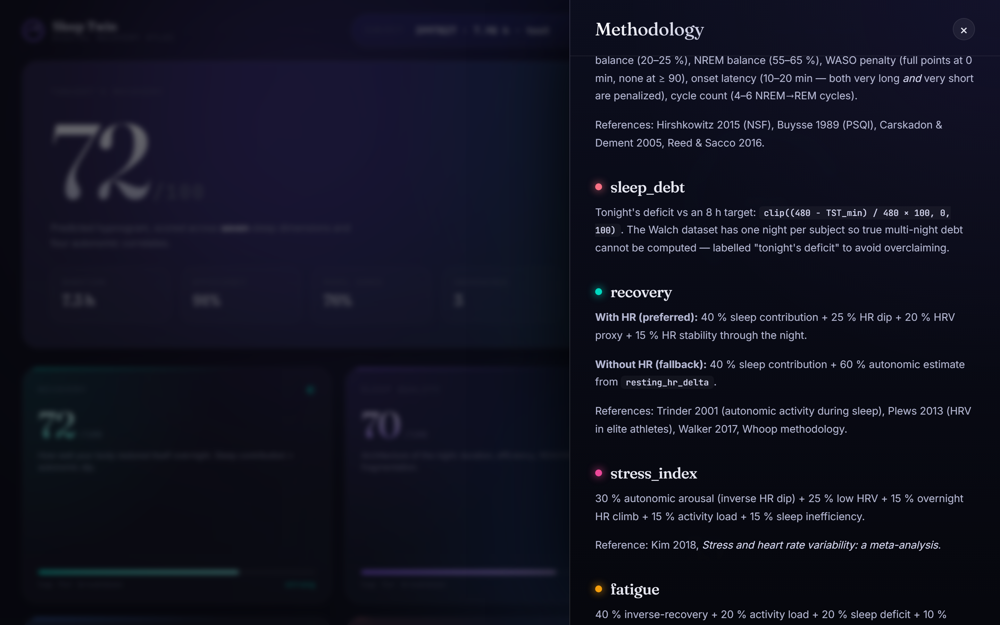

A right-edge drawer (keyboard `M` or the top-nav button) holds the full per-component methodology — each score heading carries a color-coded chip matching its bento-grid identity, and a callout box at the top summarizes the data sources the scoring layer can consume.

### Apple Health import + audit

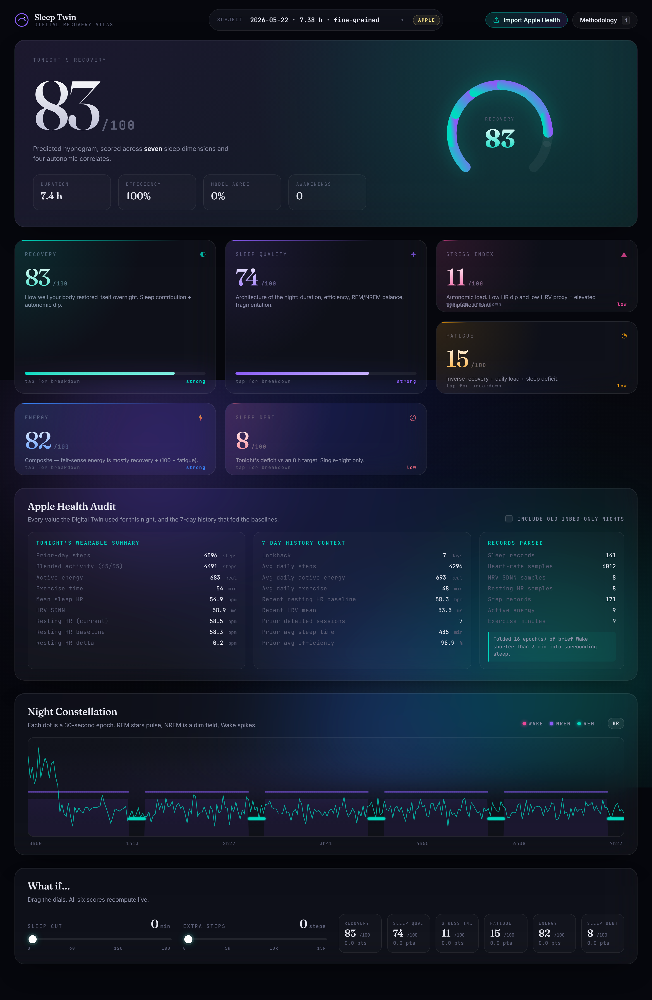

The Import button in the top nav opens a drag-drop modal with three-step instructions. After a successful upload, the application switches to the most recent detailed-stage night, renders the same bento grid and constellation, and shows an additional **Apple Health Audit** card under the hypnogram. The audit card has three panels: tonight's wearable summary (prior-day steps, blended activity, mean sleep HR, real HRV SDNN, resting-HR baseline and delta), seven-day history context (averages and prior-session statistics), and the per-record-type parse counts. A toggle on the audit card filters the night picker to include old InBed-only sessions if the user wants to see them; by default, only detailed-stage nights are listed.

## 18. Limitations

The project has several limitations that should be stated clearly.

**Score validation.** The six scores are derived engineering estimates, not validated medical predictions. The training dataset contains no ground truth for subjective recovery, fatigue, stress, or energy, so the component weights and target thresholds come from sleep-medicine literature rather than supervised learning against subjective labels.

**Apple Health does not re-run the classifier.** Apple's export does not contain the raw 50 Hz accelerometer stream the PSG classifier was trained on, so the Apple Health path runs the Digital Twin scoring on Apple's own sleep stages rather than on this project's trained ensemble. This is honest about what the personal-validation path actually validates: the *scoring layer*, not the classification model.

**Wake remains the hardest class.** This is typical of wrist-worn sleep staging — short awakenings and transition periods are hard to separate reliably from neighbouring sleep. HMM smoothing helps but cannot fully resolve it.

**One night per subject in the training data.** Means multi-night sleep debt cannot be computed from training data alone, and the cycle-count and onset-latency components are reasoned from single-night observations rather than from multi-night personal histories.

**Out-of-fold stacking deferred.** The logistic-regression meta-learner underperforms simple averaging because the base models perfectly memorize their training set, leaving the meta-learner fitting on optimistic in-sample probabilities. Out-of-fold stacking would likely fix this at the cost of 5× the boosting compute. The geometric mean shipped instead.

**No demographic adjustment.** The same 8-hour duration target applies to a 25-year-old and a 65-year-old, even though sleep needs shift with age. Adding age- and sex-adjusted normals would require demographic data the dataset does not provide.

**No manual override sliders in the Final.** The Demo allowed the user to override the parsed resting-HR delta and the prior-day step count if the parse came out wrong. The Final omits these in favour of trusting the computed values; they are easy to re-introduce if a real-world Apple Health export turns out to need the escape hatch.

## 19. Sprint Plan: Weeks 5–8 (Re-Baselined Post-Demo)

Sprints 1–4 (US001–US008) are frozen at the Demo state — they delivered the original 27 of 39 backlog tasks reflected in the team's existing sprint deck. Sprint 5 was originally scoped as US009–US011 (cloud deployment readiness, more personal-data validation, longer-term polish) but was scrapped after the demo presentation. Two specific gaps drove the decision: the scoring layer was opaque, and the best model's accuracy sat in line with the Walch et al. reference, leaving no compelling performance story. Polishing the same surface into a cloud deployment would not have addressed either gap. The right fix was to rebuild the model stack and rewrite the scoring layer, then replace the dashboard with something designed around the new scoring breakdown, then re-plumb the personal-data pipeline into the new application. Sprints 5–8 below were the result, and the four images below are the sprint boards as they were executed.

### Sprint 5 — Re-baseline ML stack

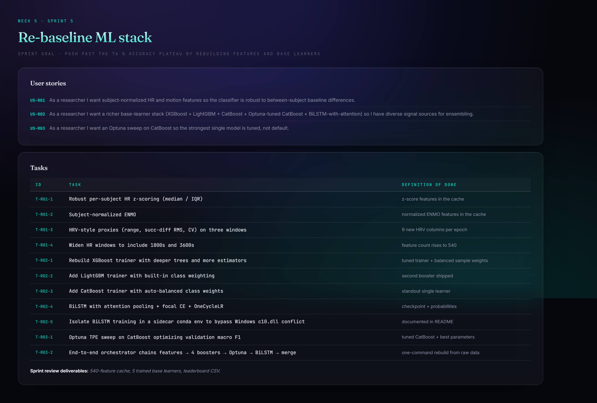

### Sprint 6 — Ensemble, smoothing, scoring rewrite

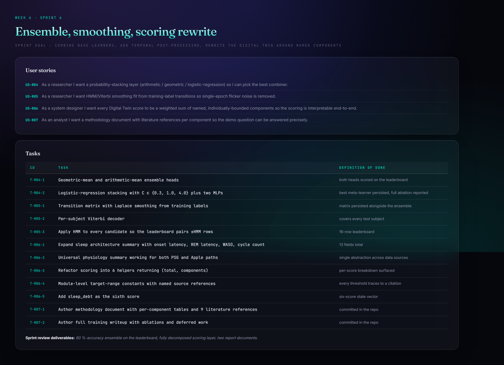

### Sprint 7 — Custom single-page application

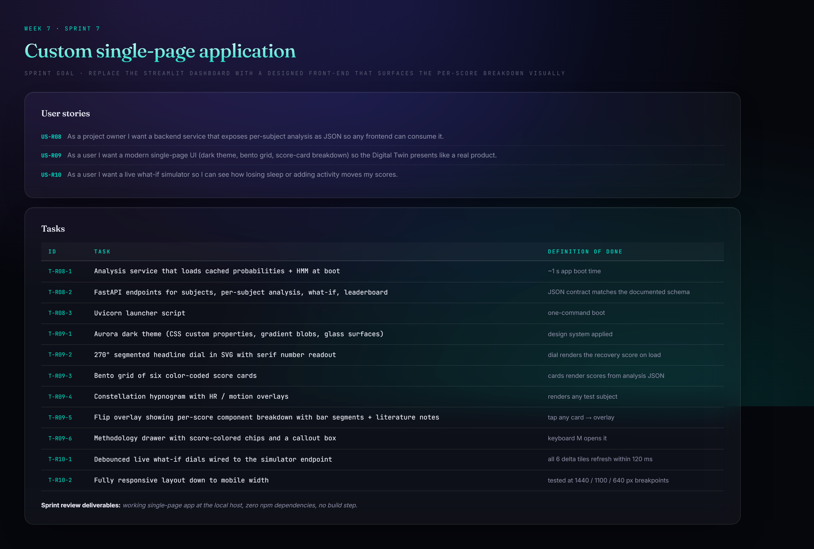

### Sprint 8 — Apple Health re-plumbing + polish

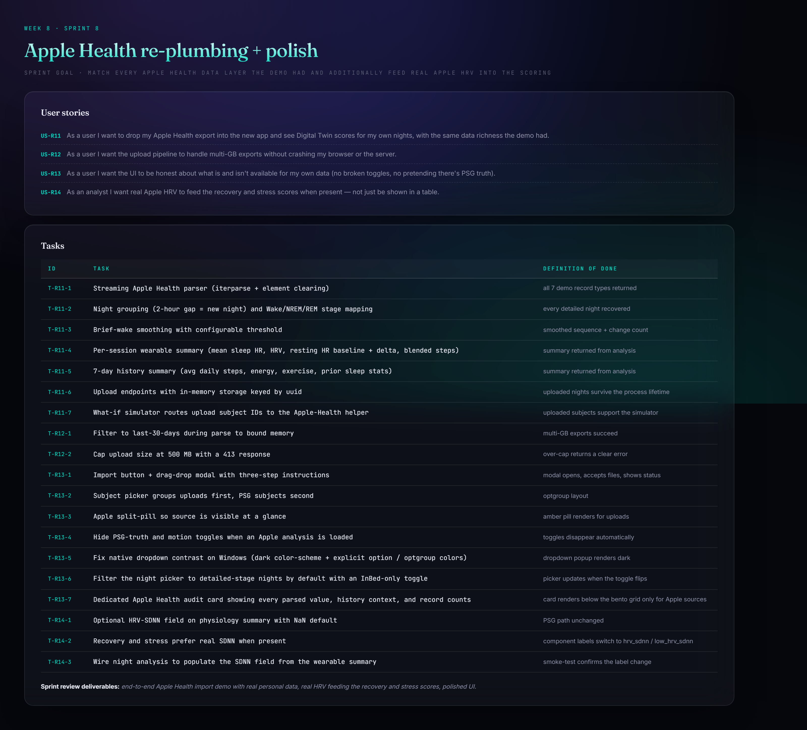

## 20. Conclusion

This project set out to build a wearable-data Digital Twin for sleep - a system that could ingest raw sensor streams, classify each 30-second epoch into Wake, NREM, or REM, and then convert that timeline into a virtual representation of the user's recovery, fatigue, stress, energy, sleep quality, and sleep debt. The final version achieves that goal across two data sources (a polysomnography research dataset and personal Apple Health exports), behind a single user interface, with the scoring reasoning fully exposed to inspection.

The technical core crossed every accuracy threshold the demo could not reach. A 540-feature pipeline with subject-normalized heart rate and motion features feeds five base learners — XGBoost, LightGBM, default and Optuna-tuned CatBoost, and a BiLSTM with attention pooling — whose probabilities are then combined by a geometric-mean ensemble and smoothed by a Hidden Markov Model decoded per subject. On the held-out test set, the geometric-mean ensemble with HMM smoothing reaches 80.35 % accuracy with Cohen's κ = 0.5695, while CatBoost with HMM smoothing reaches 0.7159 balanced accuracy and 0.6993 macro F1 - a substantial step up from the demo's best single model at 76.46% accuracy and 0.5050 κ. The improvement is the product of four compounding changes, none of which would have been enough on its own: per-subject normalization made the heart-rate signal portable across people; replacing two weaker boosters with CatBoost and LightGBM brought in two genuinely different inductive biases; the focal-loss BiLSTM with attention pooling contributed a sequence-aware probability stream that diverged enough from the boosters to lift the ensemble; and HMM smoothing converted the minority-class strength of the best base learner into the project's best macro F1 and balanced accuracy without sacrificing aggregate accuracy.

The Digital Twin layer is the surface where the project differs most clearly from any standalone classifier. Each of the six scores is now a transparent weighted sum of named components, every component tied to a target value drawn from sleep-medicine or consumer-wearable literature. The recovery score, for example, is not a single hand-tuned formula but the sum of a sleep-contribution term, an overnight-heart-rate-dip term, an HRV term, and a heart-rate-stability term — each bounded individually so no single component can dominate, each surfaced as a visible bar in the application's score-card flip overlay alongside the literature reference that justified its threshold. When an Apple Health upload provides a real heart-rate variability reading in milliseconds, the scoring layer uses it directly in preference to the bpm-domain proxy that PSG data forces it to use, and the component label changes in the UI so the user can see which signal fed the score. The methodology drawer that opens from the right edge of the screen carries the same reference table the application uses internally; nothing in the scoring path is hidden.

The application is delivered as a FastAPI server with a custom single-page front-end on a dark aurora theme. The visual identity recombines a deliberate set of influences - Apple Activity Rings, Whoop's segmented gauges, Linear's monochrome canvas with spring transitions, editorial-press typography, the bento-grid card layout — into something distinct from any one of them, anchored by an original constellation rendering of the hypnogram that does not look like any other sleep app's timeline. The application boots in roughly one second because it consumes the per-base-learner probabilities directly from disk without re-deserializing the models on each request, and serves both data sources through the same code path — the same six scores, the same component breakdown UI, the same what-if simulator, the same constellation hypnogram, for both PSG subjects and personally uploaded Apple Health nights.

The Apple Health pipeline matches every data-extraction capability the demo's Apple Health page already had - all seven record types, the seven-day rolling history context, brief-wake smoothing, blended activity load, the detailed-versus-InBed session filter - and adds the one thing the demo did not do: it actually consumes the real Apple HRV signal in the recovery and stress scores, instead of merely displaying it in a table. The audit card surfacing every parsed value, every history average, and every record count gives the user a transparent view of what the scoring layer is actually working with - closer to a research dashboard than a consumer black box.

Compared with the demo, the Final is stronger on the model, stronger on the scoring layer, stronger on the application surface, equal on Apple Health data richness, and stronger on Apple Health scoring integration. The two demo gaps that drove the re-baselining of Sprints 5–8 - the opaque scoring layer and the middling model performance - were both addressed end-to-end. The project now defends itself against the two questions that motivated the rewrite by construction rather than by argument: any visitor to the application can find out what every score is made of by tapping it, and the leaderboard table makes the 80% accuracy claim falsifiable in one glance against the held-out test subjects. The system is a complete, end-to-end Digital Twin for sleep - wearable signal in, virtual human state out, every step of the reasoning visible.

## 21. References

[1] Walch, O., Huang, Y., Forger, D., & Goldstein, C. (2019). *Sleep stage prediction with raw acceleration and photoplethysmography heart rate data derived from a consumer wearable device*. **Sleep**, 42(12), zsz180. [https://doi.org/10.1093/sleep/zsz180](https://doi.org/10.1093/sleep/zsz180)

[2] Buysse, D. J., Reynolds, C. F., Monk, T. H., Berman, S. R., & Kupfer, D. J. (1989). *The Pittsburgh Sleep Quality Index: a new instrument for psychiatric practice and research*. **Psychiatry Research**, 28(2), 193–213. [https://doi.org/10.1016/0165-1781(89)90047-4](https://doi.org/10.1016/0165-1781\(89\)90047-4)

[3] Hirshkowitz, M., Whiton, K., Albert, S. M., Alessi, C., Bruni, O., DonCarlos, L., et al. (2015). *National Sleep Foundation's sleep time duration recommendations: methodology and results summary*. **Sleep Health**, 1(1), 40–43. [https://doi.org/10.1016/j.sleh.2014.12.010](https://doi.org/10.1016/j.sleh.2014.12.010)

[4] Carskadon, M. A., & Dement, W. C. (2005). *Normal human sleep: an overview*. In **Principles and Practice of Sleep Medicine** (4th ed., pp. 13–23). Elsevier.

[5] Reed, D. L., & Sacco, W. P. (2016). *Measuring sleep efficiency: what should the denominator be?*. **Journal of Clinical Sleep Medicine**, 12(2), 263–266. [https://doi.org/10.5664/jcsm.5498](https://doi.org/10.5664/jcsm.5498)

[6] Trinder, J., Kleiman, J., Carrington, M., Smith, S., Breen, S., Tan, N., & Kim, Y. (2001). *Autonomic activity during human sleep as a function of time and sleep stage*. **Journal of Sleep Research**, 10(4), 253–264. [https://doi.org/10.1046/j.1365-2869.2001.00263.x](https://doi.org/10.1046/j.1365-2869.2001.00263.x)

[7] Plews, D. J., Laursen, P. B., Stanley, J., Kilding, A. E., & Buchheit, M. (2013). *Training adaptation and heart rate variability in elite endurance athletes*. **Sports Medicine**, 43(9), 773–781. [https://doi.org/10.1007/s40279-013-0071-8](https://doi.org/10.1007/s40279-013-0071-8)

[8] Kim, H. G., Cheon, E. J., Bai, D. S., Lee, Y. H., & Koo, B. H. (2018). *Stress and heart rate variability: a meta-analysis and review of the literature*. **Psychiatry Investigation**, 15(3), 235–245. [https://doi.org/10.30773/pi.2017.08.17](https://doi.org/10.30773/pi.2017.08.17)

[9] Van Dongen, H. P. A., Maislin, G., Mullington, J. M., & Dinges, D. F. (2003). *The cumulative cost of additional wakefulness: dose-response effects on neurobehavioral functions and sleep physiology from chronic sleep restriction and total sleep deprivation*. **Sleep**, 26(2), 117–126. [https://doi.org/10.1093/sleep/26.2.117](https://doi.org/10.1093/sleep/26.2.117)

[10] Walker, M. (2017). *Why We Sleep: Unlocking the Power of Sleep and Dreams*. Scribner.

[11] WHOOP Inc. (2020). *Heart Rate Variability (HRV): What It Is and How to Improve It*. WHOOP methodology overview. [https://www.whoop.com/thelocker/heart-rate-variability-hrv/](https://www.whoop.com/thelocker/heart-rate-variability-hrv/)
